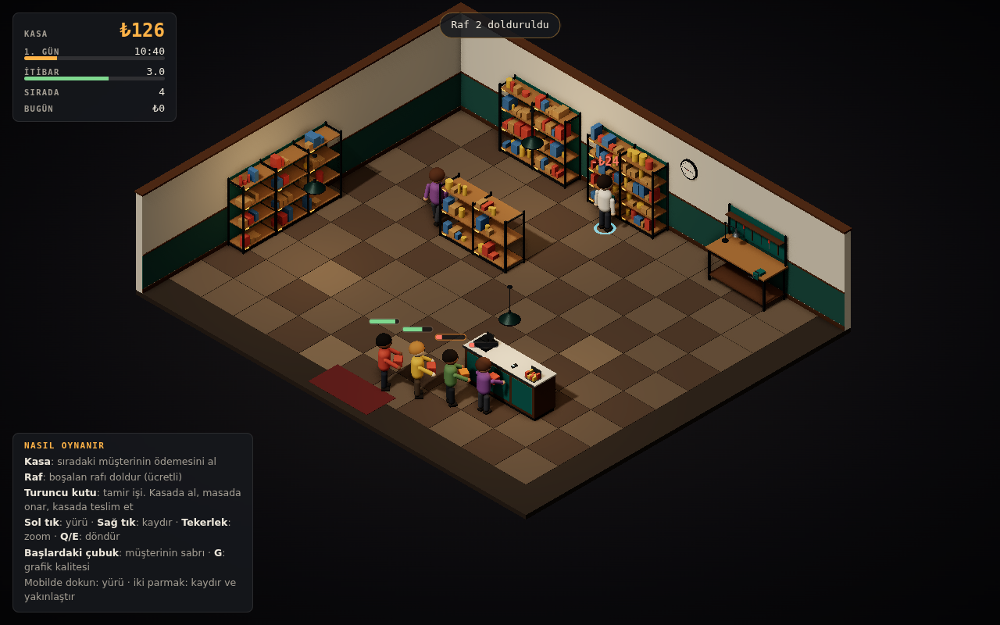

# @shop-kit — izometrik dükkan sahnesi

Vibe3D uyumlu küçük bir registry (4 model) ve bunu kullanan tıkla-yürü izometrik sahne.



**Canlı demo:** https://grkmorc.github.io/senanla/

## Oyun

Dükkan her gün 08:00'de açılır, 20:00'de kapanır (bir gün 3 dakika sürer).

- **Satış:** Müşteriler raflardan ürün alıp kasada sıraya girer. Kasaya tıkla, karakterin kasiyer yerine gidip ödemeyi alır.
- **Stok:** Her alışveriş rafı boşaltır. Raf boşken gelen müşteri eli boş gider ve itibar düşer. Rafa tıklayarak ücret karşılığında doldur.
- **Tamir:** Turuncu kutulu müşteri tamir işi getirir. Cihazı kasada al, tamir masasında 4 saniye çalış, sonra kasada teslim et.
- **Görsel:** Güneş sabahtan akşama döner ve renk değiştirir; akşam tavan lambaları devreye girer. Duvar saati oyun saatini gösterir.
- **İtibar:** İyi hizmet itibarı artırır, bekletmek düşürür. İtibar arttıkça müşteriler daha sık gelir.

## Yapı

```text
src/lib/vibe3d/model.ts              # Vibe3D protokolü: ModelInstance, PartHandle, Ownership, applyPatch
src/kits/shop-kit/materials.ts       # semantik slotlar, ref-count'lu materyal kaynağı
src/kits/shop-kit/context.ts         # createShopKit + ortak model çalışma zamanı (instantiateShopModel)
src/models/shop-kit/shop-floor.ts        # zemin + arka/sol duvar
src/models/shop-kit/modular-shelf.ts     # 1 m bölmeli modüler raf (bays, levels, stock…)
src/models/shop-kit/repair-bench.ts      # tamir masası, action: setLamp / toggleLamp
src/models/shop-kit/checkout-counter.ts  # kasa tezgâhı, action: ring() (çekmece animasyonu)
src/models/shop-kit/pendant-lamp.ts      # sarkıt tavan lambası, action: setOn
src/models/shop-kit/wall-clock.ts        # duvar saati, action: setTime (akrep/yelkovan anchor'ları döner)
src/app/shop-scene.ts                # tüketici sahnesi: renderer, loop, input, etkileşim
src/app/pawn.ts                      # eklemli oyuncu/müşteri karakterleri, yürüme animasyonu
src/app/atmosphere.ts                # gün saatine bağlı güneş, gökyüzü ve iç mekân ışığı
src/app/render-pipeline.ts           # GTAO + hover konturu + bloom + tone mapping (G: kalite)
src/game/shop-game.ts                # oyun döngüsü: müşteri YZ, kasa sırası, stok, tamir, ekonomi
src/app/iso-camera.ts                # gerçek izometrik (35.264°) Orthographic rig
src/app/nav-grid.ts                  # 8 yönlü A* + string-pull yol düzeltme
scripts/coplanar-check.ts            # vibe-model kural 9 kontrolü
registries/shop-kit/registry.json    # registry manifesti (defaultItem: kit)
```

## Çalıştırma

```sh
npm install
npm run dev         # Vite geliştirme sunucusu
npm run build       # dist/ altına üretim derlemesi
npm run typecheck   # tsc strict
npm run check       # coplanar yüz kontrolü (vibe-model kural 9)
```

## Kontroller

- Sol tık zemin: yürü · Sol tık model: soketine yürü, sonra etkileşim
- Sağ tık / Shift+sürükle: kaydır · Tekerlek: zoom · Q/E: 90° döndür · F: takip · C: serbest kamera

## Kullanım (protokol)

```ts
const kit = createShopKit()
const shelf = createModularShelf(kit, { bays: 3, levels: 5 })
scene.add(shelf.root)
shelf.configure({ stock: 0.4 })          // root ve part anchor'ları kimliğini korur
shelf.parts.goods.anchor.add(myLabel)    // rebuild'den sağ çıkar
shelf.materials.override("board", myWood) // instance > kit > varsayılan
shelf.dispose()                           // idempotent; ödünç materyaller dispose edilmez
```

## Yayın

`main` dalına her push'ta `.github/workflows/pages.yml` tip kontrolü, coplanar kontrolü ve derlemeyi çalıştırır, ardından `dist/` klasörünü GitHub Pages'e yayınlar.
