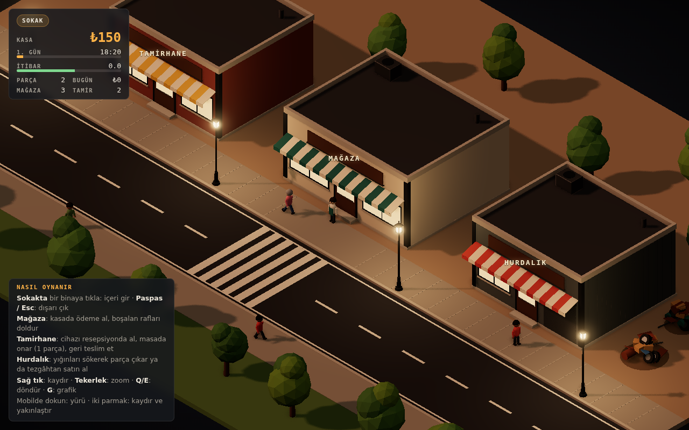

# @shop-kit — izometrik dükkan sahnesi

Vibe3D uyumlu küçük bir registry (4 model) ve bunu kullanan tıkla-yürü izometrik sahne.




**Canlı demo:** https://grkmorc.github.io/senanla/

## Oyun: Esnaf yolu

Kaldırımda bir **seyyar simit tezgâhıyla** başlarsın. Sat, para biriktir, daha büyük bir işletmeye taşın.

| Basamak | Açılış | Nasıl oynanır |
| --- | --- | --- |
| **Seyyar Tezgâh** | başlangıç | Komşu binalardan çıkan müşteriler tezgâha gelip sıraya girer. Tezgâha tıkla, sat. Simit azalınca kasalara tıklayıp mal al. |
| **Küçük Büfe** | ₺500 | İlk dükkanın. Müşteri içeri girer, dolaptan ve raftan alır, kasada sıraya girer. |
| **Mahalle Bakkalı** | ₺2.000 | Raflar dolusu ürün, daha çok müşteri, daha yüksek sepet. |
| Süpermarket | ₺12.000 | yakında |
| Esnaf Lokantası · Benzin İstasyonu · Teknoloji Mağazası | ₺20.000+ | yakında (yan dallar) |

- Sokaktaki boş binalar **KİRALIK · ₺fiyat** tabelası taşır; tıklayınca Esnaf yolu açılır.
- Soldaki **hedef kartı** bir sonraki işletme için ne kadar biriktirdiğini gösterir; para yetince parlar.
- **Geliştir (U)** o an işlettiğin yerin geliştirmelerini gösterir: şemsiye, büyük tepsi, çırak, ikinci dolap, tabela, kasiyer… **Şehir** sekmesindekiler her işletmede geçerlidir.
- Çırak / tezgâhtar / kasiyer gibi yardımcılar sen başka işle uğraşırken sıradakine satış yapar.
- İlerleme bu tarayıcıda otomatik kaydedilir.

## Yapı

```text
src/lib/vibe3d/model.ts              # Vibe3D protokolü: ModelInstance, PartHandle, Ownership, applyPatch
src/kits/shop-kit/materials.ts       # semantik slotlar, ref-count'lu materyal kaynağı
src/kits/shop-kit/context.ts         # createShopKit + ortak model çalışma zamanı (instantiateShopModel)
src/models/shop-kit/shop-floor.ts        # zemin + arka/sol duvar
src/models/shop-kit/modular-shelf.ts     # 1 m bölmeli modüler raf (bays, levels, stock…)
src/models/shop-kit/repair-bench.ts      # tamir masası, action: setLamp / toggleLamp
src/models/shop-kit/checkout-counter.ts  # kasa tezgâhı, action: ring() (çekmece animasyonu)
src/models/shop-kit/pendant-lamp.ts      # sarkıt tavan lambası, action: setOn
src/models/shop-kit/wall-clock.ts        # duvar saati, action: setTime (akrep/yelkovan anchor'ları döner)
src/models/shop-kit/shop-building.ts     # dükkan dış cephesi: kapı, vitrin/kepenk, tente, tabela, çatı
src/models/shop-kit/street-block.ts      # sokak: arsa, kaldırım, bordür, yol çizgileri, yaya geçidi
src/models/shop-kit/street-lamp.ts       # sokak feneri, action: setOn
src/models/shop-kit/scrap-pile.ts        # hurda yığını; amount azaldıkça küçülür
src/models/shop-kit/car.ts               # araba: sedan/hatch/minibüs/taksi, dönen tekerlek, fren lambası
src/models/shop-kit/traffic-light.ts     # trafik ışığı, action: setSignal (yaya lambası dahil)
src/models/shop-kit/street-cart.ts       # seyyar simit tezgâhı: stok, tepsi katı, şemsiye
src/models/shop-kit/drinks-fridge.ts     # cam kapılı içecek dolabı: stok
src/app/engine.ts                    # motor: renderer, kamera, input, oyuncu, level geçişleri
src/app/pawn.ts                      # eklemli oyuncu/müşteri karakterleri, yürüme animasyonu
src/app/atmosphere.ts                # gün saatine bağlı güneş, gökyüzü ve iç mekân ışığı
src/app/render-pipeline.ts           # GTAO + hover konturu + bloom + tone mapping (G: kalite)
src/game/economy.ts                  # ortak para, itibar, parça, saat
src/game/career.ts                   # kariyer basamakları (tezgâh → büfe → bakkal → …)
src/game/cart-stall.ts               # seyyar tezgâh oyunu
src/game/sales-floor.ts              # yürüyerek alışveriş yapılan dükkan (büfe, bakkal)
src/game/crowd.ts                    # müşteri doğurma, sıra, ayrılma
src/game/upgrades.ts                 # geliştirme kataloğu (seviye, fiyat, etki) ve Stats
src/game/save.ts                     # localStorage kayıt / yükleme / sıfırlama
src/levels/                          # outdoor (sokak + tezgâh), kiosk (büfe), grocery (bakkal) + ortak iç mekân iskeleti
src/sim/traffic.ts                   # şeritler, ışık döngüsü, takip mesafesi, yayaya yol verme
src/sim/pedestrians.ts               # kaldırımda gezen, yaya geçidinden karşıya geçen yayalar
src/app/iso-camera.ts                # gerçek izometrik (35.264°) Orthographic rig
src/app/nav-grid.ts                  # 8 yönlü A* + string-pull yol düzeltme
scripts/coplanar-check.ts            # vibe-model kural 9 kontrolü
registries/shop-kit/registry.json    # registry manifesti (defaultItem: kit)
```

## Çalıştırma

```sh
npm install
npm run dev         # Vite geliştirme sunucusu
npm run build       # dist/ altına üretim derlemesi
npm run typecheck   # tsc strict
npm run check       # coplanar yüz kontrolü (vibe-model kural 9)
```

## Kontroller

- Sol tık zemin: yürü · Sol tık model: soketine yürü, sonra etkileşim
- Sağ tık / Shift+sürükle: kaydır · Tekerlek: zoom · Q/E: 90° döndür · F: takip · C: serbest kamera

## Kullanım (protokol)

```ts
const kit = createShopKit()
const shelf = createModularShelf(kit, { bays: 3, levels: 5 })
scene.add(shelf.root)
shelf.configure({ stock: 0.4 })          // root ve part anchor'ları kimliğini korur
shelf.parts.goods.anchor.add(myLabel)    // rebuild'den sağ çıkar
shelf.materials.override("board", myWood) // instance > kit > varsayılan
shelf.dispose()                           // idempotent; ödünç materyaller dispose edilmez
```

## Yayın

`main` dalına her push'ta `.github/workflows/pages.yml` tip kontrolü, coplanar kontrolü ve derlemeyi çalıştırır, ardından `dist/` klasörünü GitHub Pages'e yayınlar.

## Yeni geliştirme eklemek

`src/game/upgrades.ts` içindeki `CATALOGUE` dizisine bir kayıt ekle:

```ts
{
  id: "repair.bench3", shop: "repair", icon: "i-wrench", name: "Üçüncü tezgâh",
  desc: "Kısa açıklama.",
  costs: [300, 600],                         // seviye başına fiyat
  value: (l) => `${2 + l} tezgâh`,           // panelde "şimdi → sonra"
  apply: (s, l) => { s.repairTime *= 0.9 ** l }, // Stats üzerinde etki
}
```

Yeni bir sayısal etki gerekiyorsa `Stats` arayüzüne ve `BASE_STATS`'a alan ekle, oyun sisteminde `eco.stats.<alan>` olarak oku. Görsel bir değişiklik (yeni model, raf vb.) için ilgili level'da `eco.upgrades.onChange(...)` dinle; `levels/sales.ts` içindeki ek raflar örnek.
